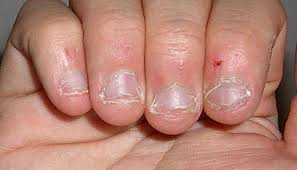

# 글쓰기

##### 2월 2일

### 습관

'습관' 이라는 말 다시 한번 자세히 보면 뭔가 어색하다.

ㅅ+ㅡ+ㅂ ㄱ+ㅗ+ㅏ+ㄴ

뭔가 어색해 보이지만 나에게는 항상 고민거리이며 골치거리이디.

그냥 한번 알아보자!

습관이라 함은

1.  오랫동안 되풀이하여 행해져서 그렇게 하는 것이 규칙처럼 되어 있는 일.

2.  학습에 의하여 후천적으로 획득되어 되풀이하여 행해진 결과 비교적 고정화하기에 이른 반응 양식.

관련해서

> '습관은 제이의 천성'  
> 바로 습관도 오래 되면 타고난 천성과 같아서 바꾸거나 고치기 어렵다는 말.

라는 말도 있다.

Yes24에 '습관' 이라는 키워드로 검색을 해보니 5,120건의 결과가 나온다.

1.  아주 작은 습관의 힘
2.  해빗 HABIT
3.  존리의 부자되기 습관
4.  습관의 완성
5.  어린이를 위한 아주 작은 습관의 힘
6.  영어독서 취미입니다.
7.  습관이 답이다.
8.  게으름이 습관이 되기 전에

등 정말 많은 습관에 관련된 도서가 있다!

### 나쁜 습관

글을 쓰며 나는 손톱을 물어 뜯고있다.....

우리나라 사람 10명 중 3명이 지니고 있다고 한다.

현재까지 밝혀진 바로는 이 버릇은 행동을 조절, 억제하는 뇌 기능과 우선순위, 중요성을 평가하는 뇌 기능 사이의 연결 회로에 이상이 생겨서 발생한다고 한다.

이 행동은 스트레스 및 우을증, 불안감 등과 관련이 있다고 한다.

#### 나는 언제 손톱을 물어 뜯는가?

고등학생 때 정말 많이 먹었다;

지금도 글을 쓰며 먹는다.

시험칠때는 필수다.

#### 손톱 물어뜨는 것의 문제점

1.  일단 손톱이 못생겨진다.

 
 

내 손톱을 보는 거 같다.

2.  염증이 생길 수 있다.

이 증상 관련해서 사진을 보고 있었는데 너무 심각해서 올리지 않겠다....

사실 나도 염증이 생겨서 정말 손을 숨기고 다녔던 적이 있다. 누가볼까봐 너무 부끄러워서 항상 주먹을 쥐고 다녔다.

 

_다른 문제점들도 많지만 내가 겪어본 문제가 아니라서 공감하기는 어려웠다._

### 좋은 습관

내가 가장 열망하는 좋은 습관은 '아침에 일찍 일어나기' 이다

일년 365일 중 300일 정도는 일찍 일어나기 위해 노력한다. 하지만 나는 1/3 도 성공하지 못한다. 꼭 여러가지 핑계를 대지만 습관(늦게 일어나는 것) 이 되었다.

일찍 일어나는 걸 좋아하는 이유는 완벽한 하루에 대한 열망과 완벽하게 보냈을때의 만족감을 알기 때문이다.

아침 일찍 일어나 아침 공기를 마시고 독서를 하며 생각하는 일은 정말 즐겁다.

또 오히려 개운하다. 덜 피곤하다.

이걸 알고 있는 사람이 일찍 일어나지 못하다니.. 너무 부끄럽다 ㅠㅠ

### 습관을 만드는 방법

> 습관을 고친다는 표현도 맞지만 만든다는 표현이 나는 조금 더 좋다.

나는 가장 중요한 것은 '포기하지 않는 것' 이라고 생각한다.  

내가 손톱 물어뜯는 습관을 가지고 있다. 손톱 물어뜯지 않는 습관을 만드는 것은 어렵다. 그런데 어렵다는 이유로 만들기를 포기한다면 나는 평생 손톱을 물어 뜯으며 배부르게 살 것이다.

나는 365일 중 365일을 일찍 일어나기 위해 다짐하지만  65일만 성공하고 300일은 실패한다. 그래서 사실 좌절감이 크다. 좌절했다고 해서 내가 포기한다면 나는 365일 중 365일을 늦게 일어날 것이다.

나는 안다. 내가 언젠가 아침형 인간이 되어 하루를 알차고 멋있게 살 것이다.

그때까지 포기하지 않을 것이다.
