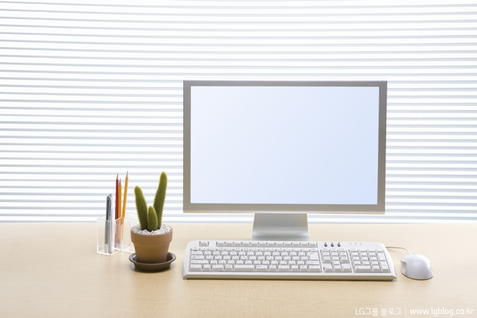
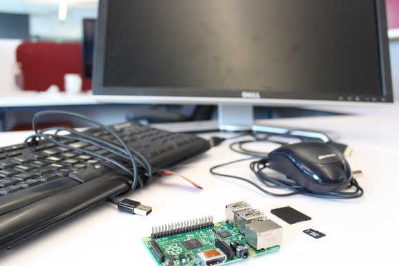
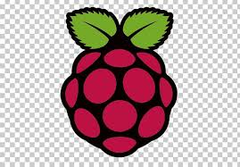
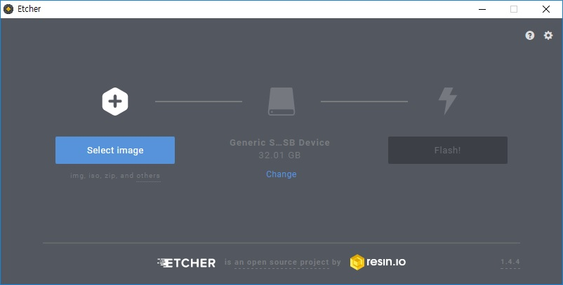
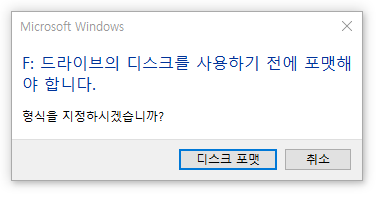
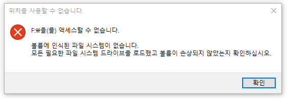
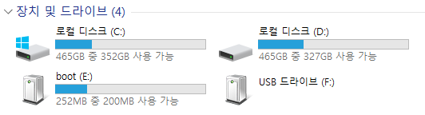
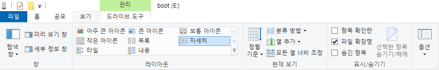
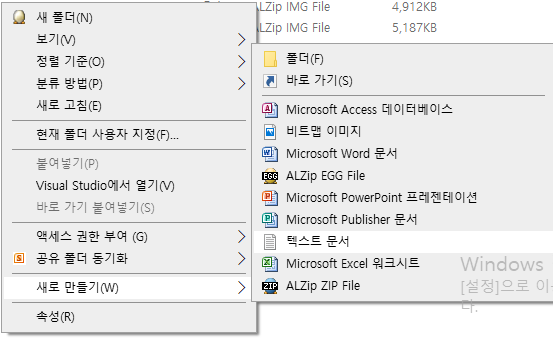
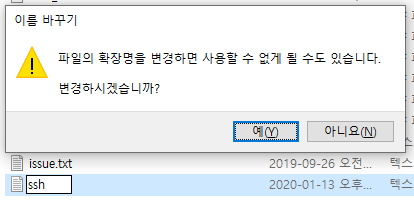

# 라즈베리파이

> 라즈베리파이는 위키백과에 명시되어 있다. 싱글보드 _컴퓨터_ 이다.

우리가 아는 컴퓨터는 다음과 같이 생겼다.

그런데 라즈베리파이는 다음과 같이 생겼다.

라즈베리파이 스펙을 간단히 보고 넘어가자  
_상세하게 CPU, GPU가 어떤 종류인지 많이 자료가 있으니 간단히 말하겠다._

1.  CPU 1.5GHZ

2.  GPU

3.  2.4 GHz and 5 GHz wireless LAN

4.  RAM 1GB or 2GB or 4GB

5.  Bluetooth

6.  GPIO 40

7.  micro SD

8.  USB 2.0 X 2, 3.0 X 2

이렇게 8가지가 있다.

간단히 비교를 위해서  
'macbook air 2015 spec' 이라고 검색해보았다.

1.  CPU 1.6GHZ

2.  GPU intel HD Graphics 6000

3.  8GB RAM

4.  128GB PCIe storage

뭐 간단히 이정도로 줄이겠다.

비교해보고 싶었던 것은 CPU 와 RAM 이었다.  

|     | 라즈베리파이  | MacBook 15 |
| --- | ------- | ---------- |
| CPU | 1.5 GHz | 1.6 GHz    |
| RAM | 4GB(최대) | 8GB        |

나는 컴퓨터에 대해 사실 잘 모른다.

그런데 스펙만 봤을 때 비벼볼 만 해 보인다!

    

* * *

# 컴퓨터로 만들기

 

  

지금의 라즈베리파이는 컴퓨터의 본체만 있다고 생각하면 이해하기 쉽다.

컴퓨터를 조립해 본 사람이 있을지 모르겠지만

컴퓨터를 조립할 때 꼭 사야하는 구성요소는 다음과 같다

1.  CPU
2.  메인보드
3.  메모리(램)
4.  저장 장치(HDD/SDD)
5.  그래픽카드(필수X)
6.  파워서플라이

지금 이 모든 게 라즈베리파이에 갖춰져 있다.

하지만 우리가 아는 컴퓨터는 이렇게 생겼다.  

  

#### 모니터, 마우스, 키보드가 필요하다.

 

#### OS가 필요하다.

컴퓨터를 처음 조립하거나, (운영체제 미포함)노트북 구매시 OS를 설치해야 한다.

흔히 사용하는 OS는 윈도우이다.

윈도우의 장점을 찾아보니 다음과 같다.

1.  한번에 여러 프로그램을 열어 놓고 수행 가능하다.

2.  대부분이 그림형태인 아이콘으로 이루어지는 GUI환경을 제공한다.

3.  명령의 입력이 아닌 사용자의 행동(클릭)으로 여러 기능들이 수행된다.

4.  window용 프로그램들 사이에는 일관성이 있어 사용자가 적응하기 쉽다.

5.  메로리 제한이 적다.

6.  도움말 기능이 풍부해 별도의 메뉴얼이 필요없다.

이를 정리하면 _사용자의 편리_ 에 모든 초점을 맞추고 있음을 알 수 있다.

그래서 사용 1순위는 Windows 인 것이다.

##### 그런데 라즈베리파이는

> 리눅스를 사용한다.

리눅스의 장점은 다음과 같다.

1.  높은 신뢰도

2.  성능

3.  기술지원

4.  구축 비용

내 생각에 많은 싱글보드 컴퓨터(라즈베리파이, 팅커보드, 오드로이드, 라떼판다 등)가 리눅스 기반의 운영체제를 사용하는 가장 큰 이유는 4번의 구축 비용이라고 생각한다. 윈도우 운영체제를 공식홈페이지에서 구매하기 위해선 가격이 208,000원이다.  

반면에 리눅스는 무료이다.

  

#### 라즈비안

라즈베리파이에서 가장 많이 사용하는 운영체제이다.  
당연히 리눅스 기반이다.

  

 

[라즈베리파이 공식 홈페이지](https://www.raspberrypi.org/)에서 다운 받을 수 있으며 어떤 걸 받아야할지 모르는 경우 [링크](https://downloads.raspberrypi.org/raspbian_latest)를 클릭하면 된다.

다운이 완료되면 Etcher 라는 SD Card에 이미지를 Writing 할 수 있는 소프트웨어를 받아야합니다.

[Etcher](https://github.com/balena-io/etcher/releases/download/v1.5.70/balenaEtcher-Portable-1.5.70.exe)를 클릭하여 다운로드합니다.

실행하면 다음과 같은 화면을 볼 수 있는데

1. 이미지 선택(라즈비안)

2. SD 카드 선택

3. Flash

3단계를 실행하고 기다리면 SD 카드에 OS가 Writing 된 것이다.

 

#### 그런데 여기서 모니터가 없는 경우

부팅을 하기전에 설정해줘야 하는 사항이 있다.

아래를 따라하자

 

|1. 취소 누르기! |2. 확인! |
| --- | --- |
|||

 

|3. boot 폴더 클릭 |
| --- |
||

 

|4. 보기 -> 파일 확장명 체크 |
| --- |
||

 

|5. 새로 만들기 |
| --- |
||

 

|6. 파일명 ssh (확장자명 지우기) |
| --- |
||

  

이제 라즈베리파이에 전원을 넣고 통신을 해보자.
