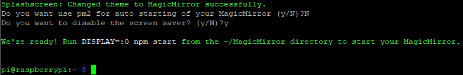
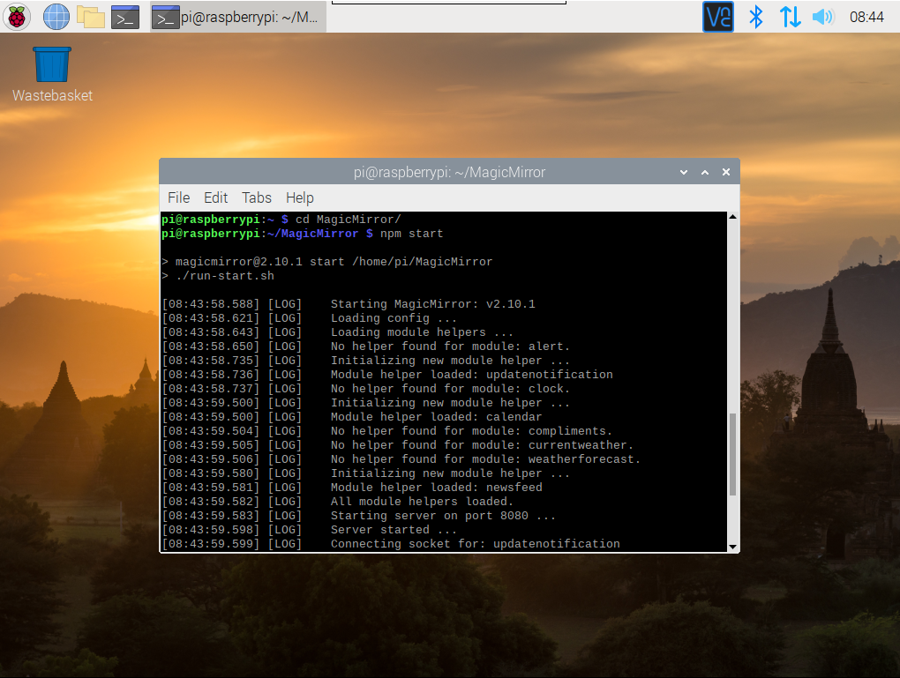
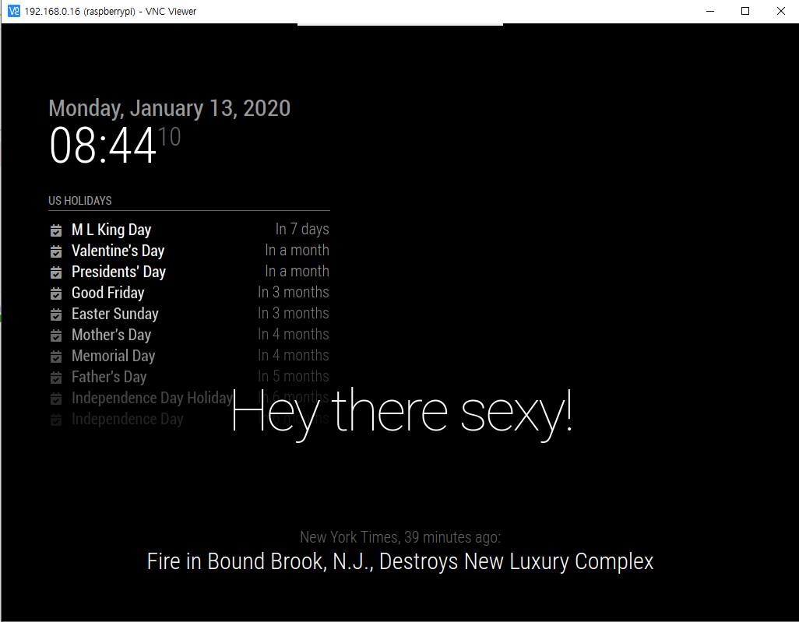

3편에서 VNC Enable 하고 Viewer 를 통해 라즈베리파이 화면을 컴퓨터에서 보았다.

지금부터의 진행은 VNC 에서 진행하겠다.

## 스마트미러 설치

스마트미러를 만드는 개발자들이 모인 포럼이 있다.

[MagicMirror_Builders](https://magicmirror.builders/)

여기에 가면 명령어 한줄을 통해 스마트미러를 설치할 수 있다.

라즈베리파이 터미널을 실행하고 다음의 명령어를 붙여넣기하여 실행해보자

```
bash -c "$(curl -sL https://raw.githubusercontent.com/MichMich/MagicMirror/master/installers/raspberry.sh)"
```

코드를 넣고 다음과 같이 화면이 나온다면 시작은 성공한 것이다.


한 20분정도를 기다리면 다음과 같은 화면이 나오며 완료가 되는데

나의 경우 첫 번째 물음에 'N' 을 누르고 두 번째 물음에 'Y'를 눌렀다.




### 실행

터미널에서 다음을 실행한다.

>cd MagicMirror
npm start



조금 기다리면 다음과 같은 화면이 나온다.

### 완성



<br/><br/>

이제 4강부터는 스마트미러의 설정값들을 하나씩 바꿔보고 [포럼](https://magicmirror.builders/)의 모듈도 하나씩 사용해 볼 것이다.
