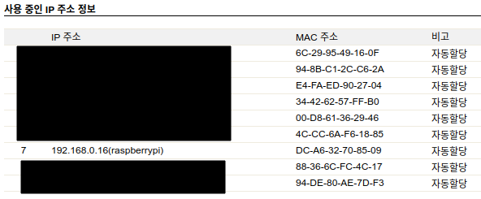
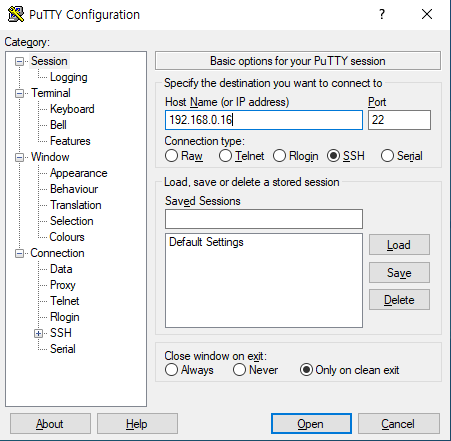
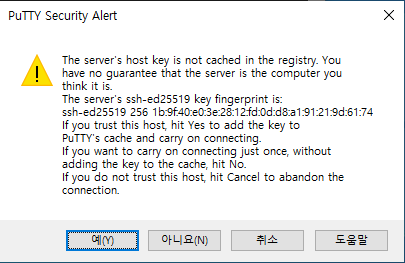
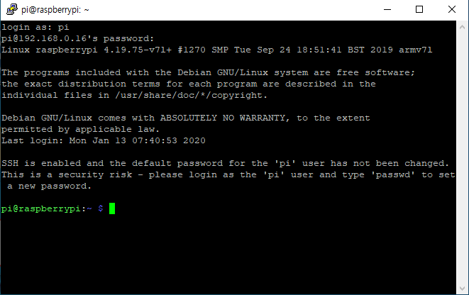
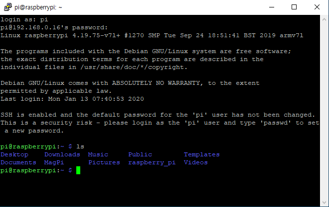
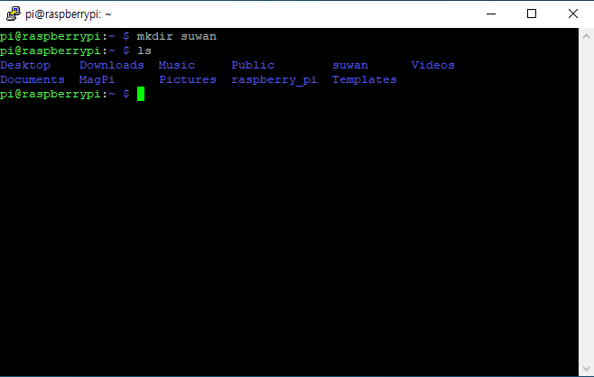
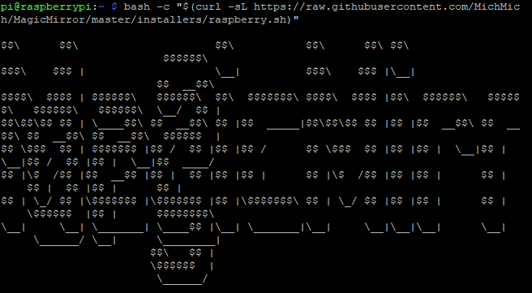

앞선 1편에서 라즈베리파이에 대한 간단한 설명과 라즈비안 설치를 진행해 보았다.

이제 LAN 케이블을 연결한 뒤 전원을 연결하자.

> 여기서 LAN 연결을 해주는 건 공유기의 IP를 받아오기 위함이다.

이제 공유기 설정 페이지로 가자(공유기 마다 지정된 주소가 다르나, 가장 많이 사용하는 IPTIME을 기준으로 하겠다.)

설정 페이지의 주소는 [192.168.0.1](http://192.168.0.1/) 이다.

관리 도구 -> 로그인 -> 고급 설정 -> 네트워크 관리 -> 내부 네트워크 설정

다음과 같은 화면을 확인할 수 있다.

라즈베리파이에 192.168.0.16 이라는 IP 주소 값이 할당된 걸 알 수 있다.

> 여기서 컴퓨터와 라즈베리파이는 같은 네트워크를 공유하고 있어야 한다  
> -> 하나의 공유기에서 나오는 와이파이나 LAN에 연결되어 있어야 한다는 의미이다.

이제 SSH 라는 통신을 진행해 볼 것이다.  

## SSH

SSH의 정의가 뭔지 한번 검색해보자.

> 시큐어 셸은 네트워크 상의 다른 컴퓨터에 로그인하거나 원격 시스템에서 명령을 실행하고 다른 시스템으로 파일을 복사할 수 있도록 해 주는 응용 프로그램 또는 그 프로토콜을 가리킨다.

잘은 모르겠지만 요약하자면 다른 컴퓨터에 접속해서 원격으로 명령을 실행한다는 거 같다.

그러니까 우리는 컴퓨터(노트북)에서 라즈베리파이에 접속해서 원격으로 명령을 내릴거다.

SSH를 위한 Putty 프로그램을 설치하자.[설치](https://the.earth.li/~sgtatham/putty/latest/w64/putty-64bit-0.73-installer.msi)

실행하고 라즈베리파이 IP 주소를 입력한다

Open을 클릭하면 다음과 같은 경고창이 나오는데 과감히 예를 누른다.

아이디와 비밀번호를 입력할 수 있는 창이 나오는데 기본 아이디, 비밀번호가 있다.

> 아이디= pi  
> 비밀번호 = raspberry

입력하면 라즈베리파이 환경에서 명령을 내릴 수 있는 터미널이 나온다.

가장 기본적인 ls 명령어이다. list의 준말로 현재 폴더가 가지고 있는 파일과 폴더를 모두 보여준다.

mkdir 명령어이다. makedirectory의 준말로 새폴더 생성과 같다.

_참고로 putty에서 붙여넣기는 오른쪽 우클릭이다,_

> mkdir suwan

다시 ls 명령어를 통해 확인해보면 suwan 이라는 폴더가 생성된 걸 볼 수 있다.

이제 SSH는 여기까지보고 VNC를 통해 라즈베리파이 화면을 실행해보자.

## VNC

VNC 또한 SSH 처럼 boot 폴더내에서 enable 시켜줄 수 있는지 잘 모르겠다.

따라서 나는 ssh를 boot 폴더에서 ssh 파일을 생성함으로써 enable 해주고 라즈베리파이 내에서 설정을 통해 enable 시켜준다.

#### 라즈베리파이의 각종 설정을 할 수 있는 명렁어이다.

> sudo raspi-config

* * *
