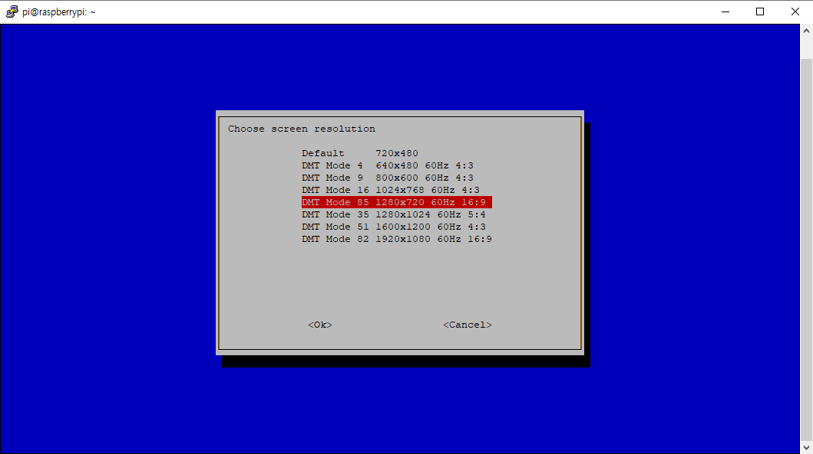

앞선 2편에서 컴퓨터와 라즈베리파이를 SSH 연결하여 컴퓨터에서 명령어를 입력했고 그 명령어를 라즈베리파이에서 실행되는 걸 보았다.

## VNC

VNC도 정의가 뭔지 한번 검색해보자.

>VNC(Virtual Network Computing, 가상 네트워크 컴퓨팅)는 컴퓨터 환경에서 RFB 프로토콜을 이용하여 원격으로 다른 컴퓨터를 제어하는 그래픽 데스크톱 공유 시스템이다. 자판과 마우스 이벤트를 한 컴퓨터에서 다른 컴퓨터로 전송시켜서 네트워크를 거쳐 그래픽 화면을 갱신하는 방식을 제공한다.

SSH 처럼 다른 컴퓨터를 제어하는 건 같은데 여기서 키워드는 그래픽 데스크톱 공유 시스템이다.

윈도우의 원격 데스크탑처럼 화면을 공유해서 제어할 수 있는 것이다.

### Enable

VNC 또한 SSH 처럼 boot 폴더내에서 enable 시켜줄 수 있는지 잘 모르겠다.

따라서 나는 ssh를 boot 폴더에서 ssh 파일을 생성함으로써 enable 해주고 라즈베리파이 내에서 설정을 통해 enable 시켜준다.

#### 라즈베리파이의 각종 설정을 할 수 있는 명렁어이다.

> sudo raspi-config

5번 Interfacing Options -> 엔터

P3 VNC -> 엔터

Yes -> 엔터

이후 Finish 를 클릭해 빠져나오면 된다.

*보통의 경우 이 방법을 통해 SSH 도 Enable 시킨다. 하지만 초기에 모니터가 없는 경우 여기까지 진행하기 어렵기에 boot 폴더를 제어했다.*

이제 VNC를 Enable 시켰으니 VNC 화면을 볼 수 있는 VNC Viewer를 다운 받아보자. [링크](https://www.realvnc.com/download/file/viewer.files/VNC-Viewer-6.19.1115-Windows.exe)

실행하면 다음과 같은 화면을 볼 수 있다.

맨 위의 창에 ip 주소 (나의 경우 192.168.0.16) 를 입력하면 된다.

그러면 아래와 같은 창이 나오게 되는데

여기서 이전에 SSH 할 때 했듯이

> 아이디 : pi
비밀번호 : raspberry

입력하면 된다

 

#### 에러

오류가 나왔다.

*Cannot currently show the desktop*

> 이럴 때 명령어를 그대로 구글에 검색해보면 된다.

 

#### 해결방법

해상도를 설정해줘야 한다고 한다.

> sudo raspi-config
> 7 Advanced Options

> A5 Resolution

>DMT Mode 85 1280x720 60Hz 16:9

이후 재부팅이 진행되며 VNC Viewer 에서 라즈베리파이 화면을 볼 수 있다.

다음에는 라즈베리파이로 가장 쉽게 진행할 수 있는 스마트 미러 프로젝트를 진행해 보고자 한다.

* * *
