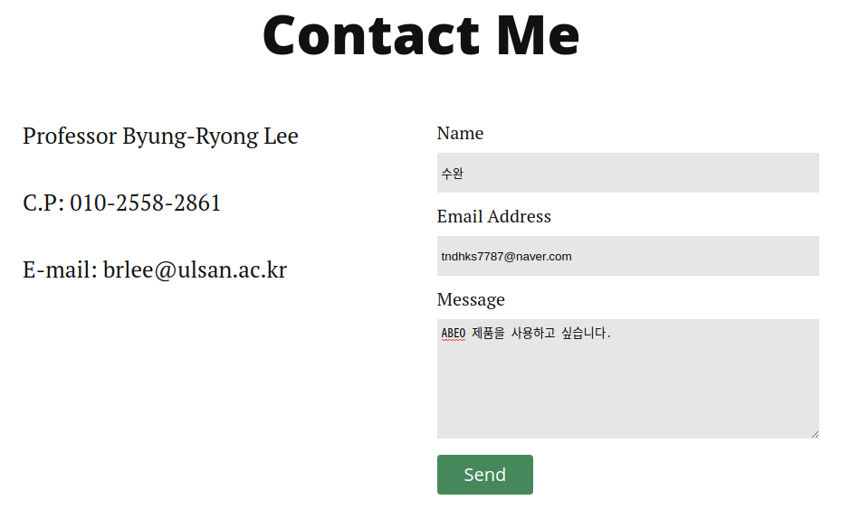
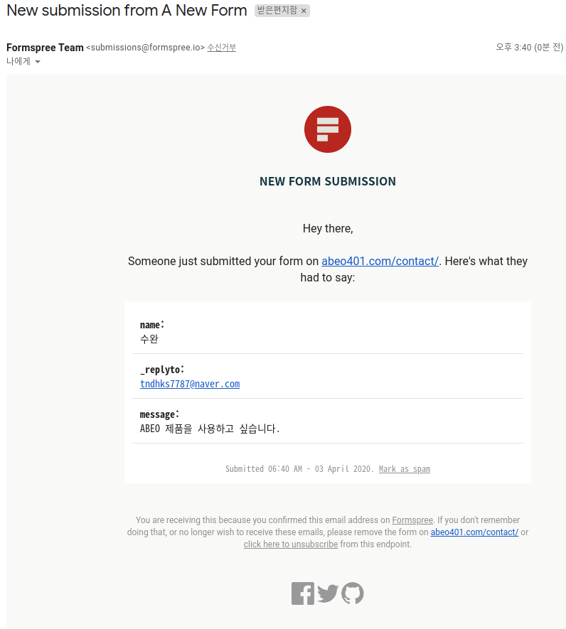
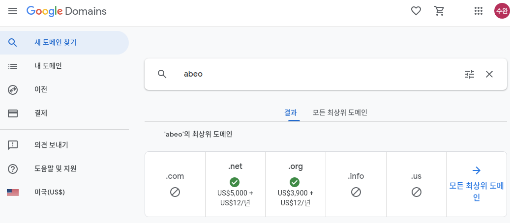

# 홈페이지 이전하기
[Abeo](http://abeo401.com)

## 카테고리
1. Home - Posts
2. About - About abeo company
3. Contact - Contact to abeo

{: width="600"}

### Post 형식
##### 마크다운
>
마크다운은 일반 텍스트 문서의 양식을 편집하는 문법이다. README 파일이나 온라인 문서, 혹은 일반 텍스트 편집기로 문서 양식을 편집할 때 쓰인다. 마크다운을 이용해 작성된 문서는 쉽게 HTML 등 다른 문서형태로 변환이 가능하다.

### Example
```markdown
---
layout: post
title:  "3D scanner (AbeoScan 4500)"
date:   2020-03-16
---


<p>-Specifications of AbeoScan 4500:</p>

 
 

 1) Performance
   - Measurement  speed: Within 1 sec (Based on 1 shot)
   - Measurement accuracy: 0.02 mm (based on 300mm distance)

 2) Features
   - Camera resolution: 2048 x 1536 at 118 FPS (3.2 Mp)
   - Light source: RGB LED beam projector (912x1140 pixel high speed pattern generator)
   - 3D scanning principle: structured light triangulation, phase-shift algorithm
   - Data extension: PLY file (Point cloud data), STL file (3D printer standard file)
```

---

### Contact

{: width="600"}

Send 클릭 시

{: width="600"}

---

## Github Domain

[Abeo401.github.io](http://abeo401.github.io)

{: width="600"}

[Abeo401.com](http://abeo401.com)