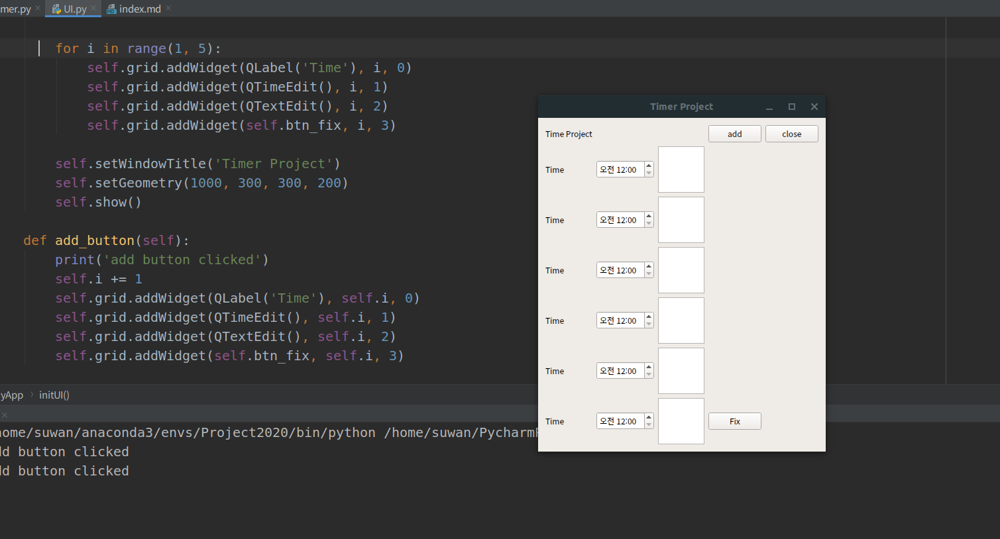

# Timer Project

## Idea

## user scenario

1. 어플을 실행한다
2. 시간대별로 할 일을 작성한다
3. 시작되고 끝이 날 때마다 알림 메시지를 준다
4. 끝이날 때 짧은 후기를 작성하게 한다

* 데이터베이스 연동

## 2019년 12월 26일

사용자 UI를 정말 간단하게 제작해보았다.

Add 버튼을 누르면 다음과 같은 모듈이 생성된다.
1. QLabel
2. QTimeEdit
3. QTextEdit  

## 개선해야 할 사항
Fix버튼을 누르면 지금 선택하는 것들이 비활성화 되어야 하고 알람이 설정되어야 한다

### 결과물 사진

