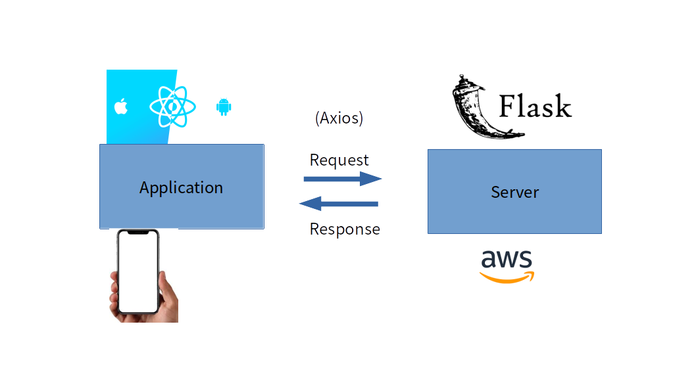
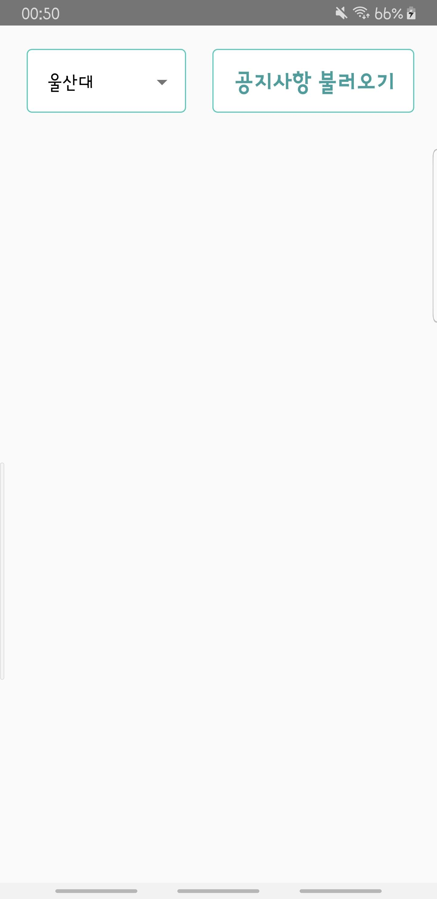
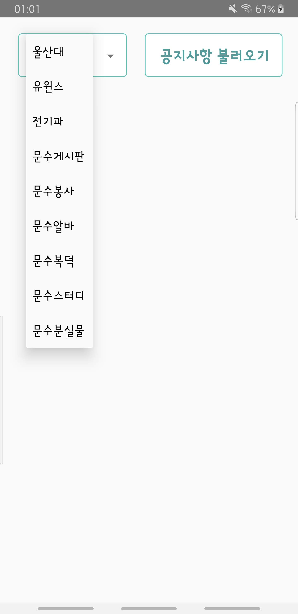
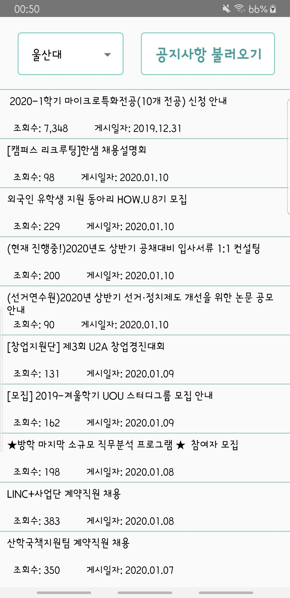
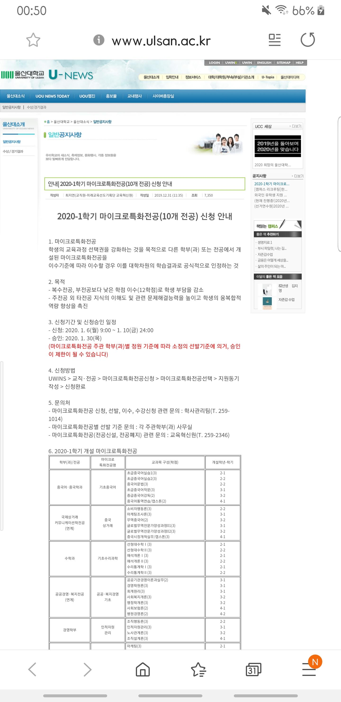

# 울산대 공지요(Ulsan Uni, Notice Board)

## 필요성(Why)

울산대학교 학생들은 공지사항을 보기에 불편함이 많다.
대학교 홈페이지 공지사항, 학생포털(Uwins) 공지사항, 문수게시판 등 각각의 웹에 접속하여 공지사항을 확인 해야한다.

## 해결(Solution)

학생들이 찾는 웹의 공지사항들을 크롤링하여 하나의 어플리케이션에 보여줌으로써 웹에 들어가서 확인해야 하는 불편함을 해소한다.

## 추가(Additional)

게시글을 추천할 수 있는 기능과 댓글을 작성할 수 있게끔 게시판을 만들어 더 정확한 정보를 제공받고자 한다.

# Version 1

## 기능(Work)

### 공지사항 불러오기(Load Notice)

구현한 사이트

1. [울산대 홈페이지](http://www.ulsan.ac.kr/unews/news/notice.aspx?o=L)

2. [유윈스 홈페이지](https://uwins.ulsan.ac.kr/JBGJ/A/MIA01S.aspx?MenuID=MIA01S!1)

3. [전기과 홈페이지](http://ee.ulsan.ac.kr/boardCnts/list.do?boardID=1262&m=04&s=ee)

4. [문수 게시판](http://www.ulsan.ac.kr/utopia/romantic/free/free.aspx?o=L)

5. [문수 봉사](http://www.ulsan.ac.kr/utopia/info/voluntary/voluntary.aspx?o=L)

6. [문수 알바](http://www.ulsan.ac.kr/utopia/info/arbeit/arbeit.aspx?o=L)

7. [문수 복덕방](http://www.ulsan.ac.kr/utopia/info/room/room.aspx?o=L)

8. [문수 장터](http://www.ulsan.ac.kr/utopia/info/barter/barter.aspx?o=L)

9. [문수 분실물](http://www.ulsan.ac.kr/utopia/info/barter/barter.aspx?o=L)

10. [문수 스터디](http://www.ulsan.ac.kr/utopia/info/barter/barter.aspx?o=L)

#### 구현 방법 Request & Response

Application 에서 Resquest 를 보내면 서버에서 결과를 처리한 뒤 Response 해주는 방법이다. Application 의 구현은 React Native 를 이용했고 Server 의 구현은 Python 의 Flask FrameWork 를 사용했다.   
결과적으로 서버는 AWS 서버에서 구현된다.




## Server

##### Request

```
{
	"check": "ulsan"
}
```

##### Response

> Return (Title, Date, Url, Views)

```
[
    [
        " 2020-1학기 마이크로특화전공(10개 전공) 신청 안내",
        "[캠퍼스 리크루팅]한샘 채용설명회",
        "외국인 유학생 지원 동아리 HOW.U 8기 모집",
        "(현재 진행중!)2020년도 상반기 공채대비 입사서류 1:1 컨설팅",
        "(선거연수원)2020년 상반기 선거·정치제도 개선을 위한 논문 공모 안내",
        "[창업지원단] 제3회 U2A 창업경진대회",
        "[모집] 2019-겨울학기 UOU 스터디그룹 모집 안내",
        "★방학 마지막 소규모 직무분석 프로그램 ★  참여자 모집",
        "LINC+사업단 계약직원 채용",
        "산학국책지원팀 계약직원 채용"
    ],
    [
        "2019.12.31",
        "2020.01.10",
        "2020.01.10",
        "2020.01.10",
        "2020.01.10",
        "2020.01.09",
        "2020.01.09",
        "2020.01.08",
        "2020.01.08",
        "2020.01.07"
    ],
    [
        "http://www.ulsan.ac.kr/unews/news/notice.aspx?o=R&a_no=20194&pageNo=1",
        "http://www.ulsan.ac.kr/unews/news/notice.aspx?o=R&a_no=20219&pageNo=1",
        "http://www.ulsan.ac.kr/unews/news/notice.aspx?o=R&a_no=20218&pageNo=1",
        "http://www.ulsan.ac.kr/unews/news/notice.aspx?o=R&a_no=20217&pageNo=1",
        "http://www.ulsan.ac.kr/unews/news/notice.aspx?o=R&a_no=20216&pageNo=1",
        "http://www.ulsan.ac.kr/unews/news/notice.aspx?o=R&a_no=20215&pageNo=1",
        "http://www.ulsan.ac.kr/unews/news/notice.aspx?o=R&a_no=20214&pageNo=1",
        "http://www.ulsan.ac.kr/unews/news/notice.aspx?o=R&a_no=20212&pageNo=1",
        "http://www.ulsan.ac.kr/unews/news/notice.aspx?o=R&a_no=20211&pageNo=1",
        "http://www.ulsan.ac.kr/unews/news/notice.aspx?o=R&a_no=20210&pageNo=1"
    ],
    [
        "7,280",
        "97",
        "227",
        "198",
        "90",
        "130",
        "162",
        "195",
        "383",
        "342"
    ]
]
```

##### Python Code

_Main.py_

> Use Flask Server for POST  
> Receive data for json  
> Return data for json

```python
from flask import Flask, jsonify, request
import ulsan

app = Flask(__name__)

@app.route('/', methods=["POST"])
def crawler():
    req_data = request.get_json(silent=True, cache=False, force=True)
    check = req_data['check']
    print(req_data)
    if check == 'ulsan':
        return jsonify(ulsan.crawler())
if __name__ == '__main__':
    app.run(debug=True, host='192.168.0.8', threaded=True)
```

_ulsan.py_

> Use BeautifulSoup for html-parse  
> Use Requests for get html code

```python
from bs4 import BeautifulSoup
import requests

def crawler():
    l = [[], [], [], []]
    for j in range(1,2):
        req = requests.get('http://www.ulsan.ac.kr/unews/news/notice.aspx?pageNo='+str(j)+'&o=L')
        html = req.text
        soup = BeautifulSoup(html, 'html.parser')

        for div in soup.findAll('tbody'):
            for each in div.findAll('a'):
                href = each.get('href')
                url = 'http://www.ulsan.ac.kr/unews/news/' + href
                l[2].append(url)
            for each in div.select('span.view-count'):
                count = each.text
                l[3].append(count)
            for each in div.select('.date'):
                date = each.text
                l[1].append(date)
            for each in div.findAll('a'):
                title = each.get('title')
                l[0].append(title)
    return l

```

> 이를 이해하기 위해선 홈페이지의 구조를 볼 필요가 있다.

크롬 개발자 도구(F12)를 통해 페이지를 구조를 살펴본다.


Tbody 태그는 tr 태그 10개로 구성되어 있다.


또 하나의 tr 태그는 td 태그로 이루어져 있으며 class 이름으로 title 이라고 설정되어 있다.


사실 Title 속성을 받아오는 방법은 정말 여러가지가 있지만 2가지만 알아보려 한다.

1. Select 메소드를 활용

```python
for div in soup.select('tbody'):
    for each in div.select('td.title'):
        title = each.text.strip()
        l[0].append(title)
```

2. findAll 메소드를 활용

```python
for div in soup.findAll('tbody'):
    for each in div.findAll('a'):
        title = each.get('title')
        l[0].append(title)
```

두가지 방법은 받아오는 정보가 차이가 있어 정보를 처리하는 방법 또한 조금 다르다.

3. Url 받아오는 방법  
   Url 은 \<a> 태그 안에 href 속성으로 있으므로 get 메소드를 통해 접근해야 한다.

---

> 최종 코드를 다시보면 조금 더 잘 보일것이다.

리스트안에 리스트를 4개를 구성했다

속성 값을 받아오는 방법이다.

| title    | date    | url    | count    |
| -------- | ------- | ------ | -------- |
| td.title | td.date | \<a> -> href | td.count |

최종적으로 리스트를 반환한다.

```python
from bs4 import BeautifulSoup
import requests

def crawler():
    l = [[], [], [], []]
    for j in range(1,2):
        req = requests.get('http://www.ulsan.ac.kr/unews/news/notice.aspx?pageNo='+str(j)+'&o=L')
        html = req.text
        soup = BeautifulSoup(html, 'html.parser')

        for div in soup.select('tbody'):
            for each in div.select('a'):
                href = each.get('href')
                url = 'http://www.ulsan.ac.kr/unews/news/' + href
                l[2].append(url)
            for each in div.select('td.view-count'):
                count = each.text
                l[3].append(count)
            for each in div.select('td.date'):
                date = each.text
                l[1].append(date)
            for each in div.select('td.title'):
                title = each.text.strip()
                l[0].append(title)
    return l
```


### 결과값 리턴하기

이제 크롤링 하는 코드를 봤으니 어플리케이션으로 값을 Response 해줘야 한다

다시 Main 코드를 보자

```python
@app.route('/', methods=["POST"])
def crawler():
    req_data = request.get_json(silent=True, cache=False, force=True)
    check = req_data['check']
    print(req_data)
    if check == 'ulsan':
        return jsonify(ulsan.crawler())
```

여기서 아래를 주목하자.

``` python
return jsonify(ulsan.crawler())
```
위의 *ulsan.py* 파일에서 List 를 반환받았다.  

리스트를 다른 코드에서 쉽게 접근하기 위해 json 형태로 반환하여 return 한다.

<br/><br/><br/>
결과적으로 

## Request
``` json
{
	"check": "ulsan"
}
```
## Response
``` json
[
    [
        " 2020-1학기 마이크로특화전공(10개 전공) 신청 안내",
        "[캠퍼스 리크루팅]한샘 채용설명회",
        "외국인 유학생 지원 동아리 HOW.U 8기 모집",
        "(현재 진행중!)2020년도 상반기 공채대비 입사서류 1:1 컨설팅",
        "(선거연수원)2020년 상반기 선거·정치제도 개선을 위한 논문 공모 안내",
        "[창업지원단] 제3회 U2A 창업경진대회",
        "[모집] 2019-겨울학기 UOU 스터디그룹 모집 안내",
        "★방학 마지막 소규모 직무분석 프로그램 ★  참여자 모집",
        "LINC+사업단 계약직원 채용",
        "산학국책지원팀 계약직원 채용"
    ],
    [
        "2019.12.31",
        "2020.01.10",
        "2020.01.10",
        "2020.01.10",
        "2020.01.10",
        "2020.01.09",
        "2020.01.09",
        "2020.01.08",
        "2020.01.08",
        "2020.01.07"
    ],
    [
        "http://www.ulsan.ac.kr/unews/news/notice.aspx?o=R&a_no=20194&pageNo=1",
        "http://www.ulsan.ac.kr/unews/news/notice.aspx?o=R&a_no=20219&pageNo=1",
        "http://www.ulsan.ac.kr/unews/news/notice.aspx?o=R&a_no=20218&pageNo=1",
        "http://www.ulsan.ac.kr/unews/news/notice.aspx?o=R&a_no=20217&pageNo=1",
        "http://www.ulsan.ac.kr/unews/news/notice.aspx?o=R&a_no=20216&pageNo=1",
        "http://www.ulsan.ac.kr/unews/news/notice.aspx?o=R&a_no=20215&pageNo=1",
        "http://www.ulsan.ac.kr/unews/news/notice.aspx?o=R&a_no=20214&pageNo=1",
        "http://www.ulsan.ac.kr/unews/news/notice.aspx?o=R&a_no=20212&pageNo=1",
        "http://www.ulsan.ac.kr/unews/news/notice.aspx?o=R&a_no=20211&pageNo=1",
        "http://www.ulsan.ac.kr/unews/news/notice.aspx?o=R&a_no=20210&pageNo=1"
    ],
    [
        "7,280",
        "97",
        "227",
        "198",
        "90",
        "130",
        "162",
        "195",
        "383",
        "342"
    ]
]
```
<br/><br/>

---


## Application

이제 Request 를 보내고 결과값을 받아와 사용자에게 보여주는 Application 차례이다.

먼저 결과물 사진을 보자


| 1. 시작화면 | 2. Picker 클릭 | 3. 불러오기 클릭 | 4. 공지사항 클릭 |
| --- | --- | --- | --- |
|  |  |  |  | 


> 직접 UI 를 해본 것이 처음이라 Layout 을 관리함에 있어서도 어려움이 많았다.

예를들어 3번째 불러오기 클릭 버튼 시 나오는 화면의 코드를 간단히 가져와 보겠다.

``` javascript
<Text style={styles.item}>{subject[i]}</Text>
<View style={styles.row}>
    <Text style={styles.b_count}>     조회수: {count[i]}          </Text>
    <Text style={styles.b_date}>게시일자: {date[i]}</Text>          
</View>
```

조회수 앞에서 보이는 띄어쓰기는 
``` javscript
&nbsp;
```
를 통해 구현해도 되지만 Layout 을 잘 조절한다면 충분히 해결할 수 있는 문제이다.  
또 태블릿 PC 같은 환경에서도 쉽게 적용이 되게 하려면 Layout 구성을 함으로 써 배치를 하는 것이 이상적이다. 

### 주요 코드
아래는 공지사항 불러오기 버튼을 클릭했을 때 실행되는 메소드이다.

디폴트 값을 설정해 주지 않으면 오류가 났던 것으로 기억한다. 

Picker 를 통해 받아온 value 값을 check 인자로 Post 방식을 통해 Request 한다.

전달되면 서버에서 크롤링을 진행한 뒤 json 파일을 Response 받는다.

json 파일을 해석하는 부분이 then(response) 이다.

``` javascript
  onRequestButtonClicked(value){
    if(value == null){
      value = 'ulsan';
    }
    http.post('/',{
      check: value,
    })
    .then((response) => this.setState({subject: response.data[0], date:response.data[1], url:response.data[2], count:response.data[3]} ))
    Toast.show('로딩중입니다.');
  }
```

<br/><br/><br/>

---

## 구글 플레이스토어 업로드(Upload Google Play Store)


<br/><br/><br/>

---

## 향후 과제 (Future challenges)

### 추천 버튼

단순히 조회수 만으로 학생들이 선호한다고 판단할 수 없다.

학생들이 직접 추천 버튼을 누름으로써 학생들을 위한 더 좋은 기회가 제공됐으면 한다.

## 댓글 기능

각각의 게시글에 학생들이 댓글을 작성함으로써 다른 학생들과 혹은 담당자와 소통할 수 있다.
