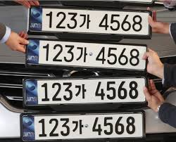
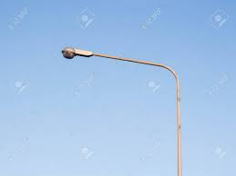

머리를 쓰면 쓸수록 좋아진다는 것은 이미 뇌 과학 연구를 통해 입증이 된 사실이다.  
많은 사람들이 말한다.

> 이제는 죽을 때까지 공부해야하는 시대이다.

나는 IT업계에 종사할 예정이다. 이런 나에게는 더더욱 와 닿는 말이다.

새로운 기술과 트렌드를 받아들이는 것에 익숙해져야 하며 빠르게 배울 수 있는 능력이 중요한다 생각한다. 당연히 머리는 많이 쓰게 될 것이다.  

그래서 내 머리를 좀 단련시켜 놓으려 한다. 이렇게 글을 쓰는 행위도 머리를 단련하기 위함이다.  

_글을 쓰는 행위를 통해 배우는 점은 또 다른 글에서 다뤄보고 싶다. 나도 생각해봐야 한다._

* * *

## 이 글에서는 머리를 단련시키는 방법에 대해 생각해보려 한다.

검색해 보았다. "두뇌 훈련" 방법론에 대해서 내가 본 블로그에 나온 방법 6가지를 먼저 소개하겠다.

1.  눈 감고 밥 먹기
2.  주머니 속 동전 알아맞히기
3.  귀 막고 계단 오르내리기
4.  코 막고 커피 마시기
5.  TV 프로그램 소리내어 읽기
6.  커피향 맡으며 물고기 사진 보기

_적으면서 피식하고 이해가 되지 않았다._

각각의 방법들은 오감을 자극함으로써 대뇌피질을 자극한다는 둥 이런 자세한 설명이 있다.  

하지만 나는 딱히 공감할 수 없었다. 별로 따라할 마음도 들지 않았다.

내가 하는, 내가 할 두뇌 훈련법을 정리하고 생각해 보고자 한다.

## 자동차 번호판으로 사칙연산하기

차 번호판을 보면 12바 3456과 같이 숫자로 이루어져 있다.  

_검색해보니 이제부턴 앞자리가 3자리로 바뀐다고 한다_  
<left></left>

계산할 수 있는 방법은 여러가지이다.

1.  34 + 56 = 90  
2.  12 + 3456 = 3468
3.  34 \* 56 = 1904  
4.  12 \* 3456 = 41472

4번은 암산이 어려웠다.. 이렇게 계산을 연습 하다 보면 연산을 하는데 노하우가 생긴다.

점점 재밌어진다.

## 사물에 빙의해보기

조금 이상할 순 있지만 재밌는 방법이라 생각한다.  

다른 사람의 입장에서 생각해보는 건 정말 중요한 능력이다.

내가 그 사물이 되었다 생각하고 그 사물의 역할이나 불편함에 대해 생각해보는 것이다.

예를 들어보자   

<left></left>

>나는 가로등이다.  
내가 하는 역할은 사람들의 길을 비춰 주는 것이다.  
나는 밤이 되면 켜진다.  
내가 밤이 되는 건 나한테 센서가 붙어있어서 안다.  
조도센서가 있는데 값이 50이하가 되면 불을 킨다.  
나는 이 자리에서 어제 밤 일어났던 살인을 아는데 말할 수가 없어 너무 답답하다.  

나도 지금 생각해서 적은 것이지만 생각보다 더 재밌다.

잠깐 가로등이 되었던 것으로 가로등의 원리를 파악할 수 있었고 가능성을 보았다고 생각한다.

역시 재밌다.

## 뒤편엔 뭐가 있을까 상상하기
사람들은 걸었던 길을 어제도 걷고 오늘도 걷는 경우가 많다.

하지만 새로운 것을 보려고 생각한다면 기시감을 느끼게 되는 경우가 많다.

앞을 보며 걷는다. 뒤를 보며 걷는 사람은 아마 없을 것이다.

앞을 건물을 보고 그 뒤엔 뭐가 있을까 상상해보자.

노력한다면 꽤 익숙한 패턴을 찾을 수 있을 것이다.  
<left></left>

>A 음식점 뒤에 주차장이 있었다.  
그런데 B 음식점 뒤엔 주차장이 없었다.  
A는 쭈구미 전문점이었으며 B는 버거킹이었다.  
과연 C 돈가스 음식점 뒤에는 주차장이 있을까?  
있을수도 없을수도 있다, 있으면 왜 있고, 없으면 왜 없는지 생각해보자
